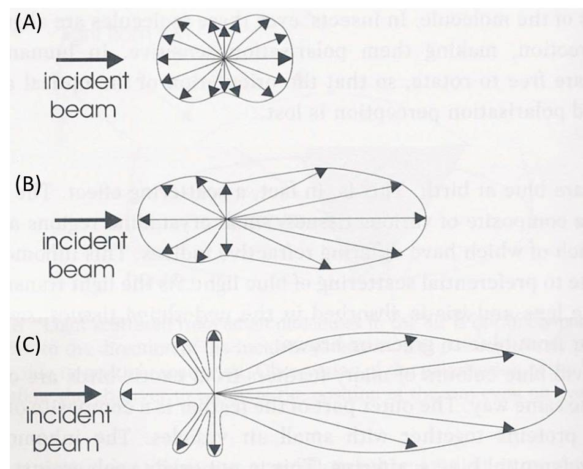

What is common between the blue irises (eyes) and the car-headlight beams visible on foggy nights? Both arise from the Tyndall effect or Tyndall scattering - the scattering of light by fine particles dispersed in a light-transmitting medium. If a beam of light passes through an optically transparent dispersion medium, the path of the beam becomes visible when viewed at the right angle to the direction of the incident light beam (Figure 1). The phenomenon of scattering of light by suspended particles is known as the Tyndall effect or Tyndall scattering, named after the Irish scientist John Tyndall who first studied it extensively (in 1869). The luminous path that results from the visible scattering along the path of the light beam is called "Tyndall Cone" or Tyndall beam. Tyndall effect is observed when light falls on particles of cross-sections in the approximate 40 and 900 nm range suspended in a transparent medium. Such media are nothing but colloidal systems. We know that colloidal systems are those where particles of roughly 1 nm (10-9 m) to 1 μm (10-6 m) sizes are dispersed in a continuous medium. Tyndall effect is therefore used in identifying whether a mixture is a colloid, pure liquid, or a true solution. Visible light scatters in various directions in colloidal dispersion, whereas a pure liquid or a true solution does not show luminous path scattering. Therefore, the observation of the Tyndall effect indicates the existence of a colloidal dispersion. This effect has been observed in colloids with as low as 0.1 parts per million (ppm) of the dispersed phase.

Figure 1. Demonstration Tyndall effect. A laser pointer has been used as a light source. The left glass contains 5 ppm of colloidal silver, and the right one tap water. The path of the light beam can be clearly seen in the left glass.

Electromagnetic radiation and matter interactions can broadly be of the following three categories: (i) scattering, (ii) absorption, and (iii) emission. Scattering is a physical process that involves deviation of electromagnetic radiation (e.g., light), sound, or moving particles from a straight trajectory due to the interaction with various units, or due to the presence of one or more localized non-uniformities, in the medium through which they pass. In the scattering of electromagnetic radiations, energy is removed from the beam of the electromagnetic radiation and re-emitted almost instantaneously with a change in direction, phase, and/or wavelength (Figure 2). Any portion of a material medium where the refractive index shows discontinuity with respect to the surrounding medium (optically inhomogeneous), such as a particle, droplet, bubble, or even a density fluctuation, can scatter radiation. Therefore, the scattering of electromagnetic radiation by any medium is a common phenomenon, and the visible appearances of many objects are due to light scattering. Pure liquid or true solutions which have ions of solute molecules of very small sizes appear optically homogeneous and therefore cannot scatter light.

We know that the fields of electromagnetic radiation can accelerate charged particles and the accelerating charges radiate energy. When the electromagnetic wave interacts with a particle, the electron clouds within the particle's constituent atoms/molecules are driven periodically by the electric field of the incident wave. This oscillation of the electron cloud leads to a periodic separation of charge resulting in an induced dipole moment. The oscillating induced dipole moment reradiates energy in different directions or acts as a source of electromagnetic radiation. This re? The distribution of the incident radiation energy gives rise to light scattering. Most of the light scattered by the particle has the same wavelength as that of the incident light. Such scatterings are called 'elastic' scatterings, e.g., Tyndall scattering, Rayleigh scattering, and Mie scattering, which involve negligible energy transfer and, therefore, no wavelength change. On the other hand, Raman scattering, Brillouin scattering, and Compton scattering occur with energy transfer and are therefore examples of 'inelastic' scatterings.

Scattering studies show that the degree of scattering or the re-distribution of radiation energy during the scattering process depends on factors like angle, polarization, coherence, and the ratio of the scatterer (particle) diameter to the wavelength of the radiation, α = (2πr)/λ, where r is the spherical particle radius, and lambda; is the relative scattering wavelength defined as: λ = λ0/m0, where λ0 is the wavelength of incident light with respect to vacuum and m0 is the refractive index of the surrounding medium. Based on this ratio, light scattering can be divided into three domains:

1.  α << 1 (i.e., when the particle is very small compared to the wavelength of the light): Rayleigh scattering;

2.  α ≈ 1 (i.e., when the particle size is comparable to the wavelength of the light): Mie scattering; and

3.  α >> 1 (i.e., when the particle size is very large compared to the wavelength of the light): Geometric scattering.

In the Rayleigh scattering, particles have diameters of the order of λ/10 or less. Such small particles scatter almost equally both in the forward and backward directions, and the exact shape of the particle is usually immaterial. This kind of scattering has a strong dependence on wavelength and an even stronger dependence on particle size. The scattered intensity varies as V2/λ4 (i.e., proportional to the square of particle volume, V, or to the sixth power of the diameter, and inversely as the fourth power of wavelength, λ). Therefore, for given particle size, violet light is scattered about eight to ten times more than red light. This explains why the sky appears blue on a clear day. In fact, air molecules like N2 and O2, which have sizes within the Rayleigh regime, scatter mainly short-wavelength blue end of the sunlight.

Scattering by particles larger than the Raleigh range is generally known as Mie scattering. In this regime, the scattered intensity becomes proportional to ~1/λ2. The shape of the scatterer plays a significant role in Mie scattering. As the particle size increases, the scattering pattern changes from the symmetrical Rayleigh type to a sharper and more intense forward lobe-dominant pattern. As the particle size becomes comparable to or larger than the wavelength, λ (as in the cases of colloidal systems), scattered intensity in the forward direction increases further, and secondary maxima and minima appear at various angles (Figure 3). Such scatterings, especially by particles of sizes >λ, are referred to as Tyndall scattering. Often the light is scattered by the larger particles in all directions rather than asymmetrically. The brilliance of the Tyndall cone depends on the magnitude of the difference in refractive index between the particle and the surrounding medium.

The Tyndall effect is not used to determine the concentration of a solution, though, for a given particle size, the Tyndall effect increases linearly with the particle concentration. This is because the Tyndall effect shows the third power of particle size dependence for a given concentration. For example, compare the Tyndall effects of a 1 ppm sol of 10 nm sized particles and a 10 ppm sol of 1 nm sized particles. Based on the concentration effect, the Tyndall effect of the former sol system should be 1/10 as bright as the latter system. However, the Tyndall effect of 1 ppm 10 nm sized particles is 100 times brighter than the 10 ppm 1 nm particles due to the particle size effect.

It should be remembered that in the previous discussion of scattering it is assumed that the particles are insulating and non-absorbing. However, many particles (e.g., metal particles) are strong absorbers of light. As the amount of absorbed light is roughly proportional to V/λ (as compared to the V2/λ4 dependence of the amount of scattered light), the light absorption may dominate (if energy gap matches) over scattering when the volume of the particles becomes smaller.

 
  

Schematics of scattering of incident light off a particle in solution

Figure 2: Schematics of scattering of incident light off a particle in solution.

 
  

Schematic illustration

Figure 3. Schematic illustration of the distribution of the light scattered (shown as arrows within envelope) by small particles acting as scattering centers (the origin of all arrows). (A) Rayleigh scattering from particles much smaller than the wavelength of light. (B) Mie scattering for particles of sizes approaching the wavelength of light. The scattering becomes pronounced in the forward direction. (C) For particles larger than the wavelength of light, lobes of scattered intensity appear, which are wavelength dependent and so give rise to colours at specific viewing angles. These are called the higher-order Tyndall effect. (Courtesy: Colour and the Optical Properties of Materials, R. Tilley, John Wiley, 2000)
